|Идентификатор|Имя|Тип|Подробнее|Уровень|
|---|---|---|---|---|
|0x00| - | - | - | - |
|0x01|Cat with the gun| A |   | 3 |
|0x02|Gray land hat| B |   | 3 |
|0x03|Black land hat| B |   | 3 |
|0x04|Land Diver| A |   | 3 |
|0x05|Land Diver| A |   | 2 |
|0x06|Land Diver| A | [Земной водолаз](#враг-06) | 1 |
|0x07|Zenigata| A |   |All|
|0x08|Shooter with bazooka| A |   | 3 |
|0x09|The fat sailor| A |   | 3 |
|0x0A|The barrel| B |   | 3 |
|0x0B|Jumping sailor| B |   | 3 |
|0x0C|The lift| A |   | 3 |
|0x0D|Sensor| B |   | 3 |
|0x0E|Bat| B | [Летучая мышь](#враг-0e) | 1 |
|0x0F|Gray cat| B | [Серый кот](#враг-0f) | 1 |
|0x10|Nun| A |   | 2 |
|0x11|Girl in red, in the castle| A | [Девушка в красном](#враг-11) | 1 |
|0x12|Batterfly| B |   | 2 |
|0x13|Broned batterfly| B |   | 2 |
|0x14|Shooter with bazooka| A |   | 2 |
|0x15|Sensor| B |   | 2 |
|0x16|Black cat| B | [Чёрный кот](#враг-16) | 1 |
|0x17|Karate-boy| A |   | 2 |
|0x18|Karate-boy in blue on the street| A |   | 2 |
|0x19|Karate-girl| A | [Каратистка](#враг-19) | 2 |
|0x1A|Boy in green| A |   | 2 |
|0x1B|Girl with sword| A | [Девушка в красном, с мечом](#враг-1b) | 1 |
|0x1C|Knight in armor with a shield| A | [Рыцарь в доспехах](#враг-1c) | 1 |
|0x1D|The barrel| B |   | 2 |
|0x1E|Sensor| B |   | 1 |
|0x1F|Fly man| A | [Летающий человек](#враг-1f) | 1 |
|0x20|Shooter with bazooka| A | [Стрелок из базуки](#враг-20) | 1 |
|0x21|Cobblestone| B |   |4, racing|
|0x22|The bird| B |   |racing|
|0x23|The bird with a bomb| B |   |racing|
|0x24|Skeleton| A |   | 4 |
|0x25|Diver| B |   |   |
|0x26|Mummy| A |   | 4 |
|0x27|Gargoyle| B | [Гаргулья](#враг-27) | 4 |
|0x28|Boss| A |   | 1 |
|0x29| ? |   |   |   |
|0x2A|Boss| A |   | 2 |
|0x2B| ? |   |   |   |
|0x2C|Boss| A |   | 3 |
|0x2D| ? |   |   |   |
|0x2E|Boss| A |   | 4 |
|0x2F| ? |   |   |   |
|0x30|Wall| B |   | 4 |
|0x31|Wall| B |   | 4 |
|0x32|Breaking platform| B |   | 4 |
|0x33|Blade trap| B |   | 4 |
|0x34|Potted snakes| B |   | 4 |
|0x35|Egyptian with bow| A |   | 4 |
|0x36|Egyptian with a sword| A | [Египтянин с мечом](#враг-36) | 4 |
|0x37|Egyptian with a boomerung| A | [Египтянин с бумерангом](#враг-37) | 4 |
|0x38|Ninja upside down| A | [Ниндзя сверху](#враг-38) | 4 |
|0x39|Sensor| B |   | 4 |

## Враг 06
Земной водолаз, версия 1
<!---

-->
<!---

-->
|Кадр 1|Кадр 2|Кадр 3|Кадр 4|Кадр 5|Кадр 6|Кадр 7|
|---|---|---|---|---|---|---|
| 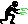 | 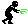 | 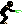 | 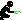 | 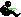 |  | 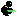 |
| 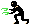 | 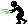 | 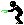 | 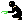 | 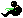 |  | 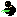 |
<!---

-->
<!---
Статусы

-->

## Враг 0E
Летучая мышь
|Кадр 1|Кадр 2|Кадр 3|
|---|---|---|
|  |  |  |
|  |  |  |
<!---
Статусы

-->

## Враг 0F
Серый кот
|Кадр 1|Кадр 2|Кадр 3|Кадр 4|Кадр 5|
|---|---|---|---|---|
|  |  |  |  |  |
|  |  |  |  |  |
<!---
Статусы

-->

## Враг 11
Девушка в красном
|Кадр 1|Кадр 2|Кадр 3|Кадр 4|Кадр 5|Кадр 6|Кадр 7|Кадр 8|
|---|---|---|---|---|---|---|---|
|  | 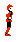 | 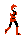 | 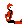 | 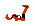 | 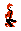 | 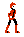 | 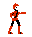 |
| 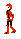 | 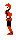 | 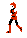 | 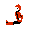 | 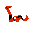 | 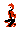 | 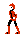 | 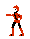 |
<!---
Статусы

-->

## Враг 16
Чёрный кот
|Кадр 1|Кадр 2|Кадр 3|Кадр 4|Кадр 5|
|---|---|---|---|---|
| 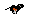 | 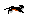 | 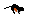 | 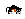 | 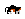 |
| 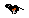 | 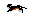 | 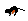 |  | 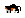 |
<!---
Статусы

-->

## Враг 19
Каратистка
|Кадр 1|Кадр 2|Кадр 3|Кадр 4|Кадр 5|Кадр 6|Кадр 7|Кадр 8|Кадр 9|
|---|---|---|---|---|---|---|---|---|
|  |  |  |  |  |  |  |  |  |
|  |  |  |  |  |  |  |  |  |

|Кадр 1|Кадр 2|Кадр 3|Кадр 4|Кадр 5|Кадр 6|
|---|---|---|---|---|---|
|  |  |  |  |  |  |
|  |  |  |  |  |  |
### Статусы

-  ***N*** - направление врага (**_0x00_** - вправо, **_0x01_** - влево)
-  ***M*** - флаг прыжка, например через препятствие (**_0x00_** - не прыгает, **_0x01_** - прыгает)
-  ***L*** - используется совместно с ***K***, флаг выстрела (**_0x00_** - неактивно, **_0x01_** - активно)
-  ***K*** - флаг уклонения от выстрелов (**_0x00_** - неактивно, **_0x01_** - активно)
-  ***W*** - флаг приседания перед прыжком (**_0x00_** - неактивно, **_0x01_** - активно)
-  ***Z*** - флаг умирания врага (**_0x00_** - неактивно, **_0x01_** - активно)
-  ***Y*** - флаг получения урона врагом (**_0x00_** - не получает урон, **_0x01_** - получает)
-  ***X*** - общий флаг активности статусов (**_0x00_** - статусы не используются, **_0x01_** - используются)

## Враг 1B
Девушка в красном, с мечом
|Кадр 1|Кадр 2|Кадр 3|Кадр 4|Кадр 5|Кадр 6|Кадр 7|Кадр 8|Кадр 9|
|---|---|---|---|---|---|---|---|---|
|  |  |  |  |  |  |  |  |  |
|  |  |  |  |  |  |  |  |  |
<!---
Статусы

-->

## Враг 1С
Рыцарь в доспехах
|Кадр 1|Кадр 2|Кадр 3|Кадр 4|Кадр 5|Кадр 6|Кадр 7|Кадр 8|Кадр 9|
|---|---|---|---|---|---|---|---|---|
| 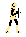 | 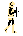 | 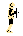 |  |  | 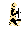 | 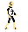 | 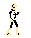 | 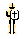 |
| 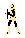 | 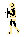 | 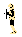 |  |  | 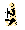 | 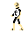 | 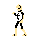 |  |
### Статусы

-  ***N*** - направление врага (**_0x00_** - вправо, **_0x01_** - влево)
-  ***M*** - флаг прыжка, например через препятствие (**_0x00_** - не прыгает, **_0x01_** - прыгает)
-  ***L*** - флаг ближнего контакта, атака мечом (**_0x00_** - неактивно, **_0x01_** - активно)
-  ***K*** - флаг скрытия "в стене" (**_0x00_** - неактивно, **_0x01_** - активно)
-  ***W*** - флаг приседания перед прыжком (**_0x00_** - неактивно, **_0x01_** - активно)
-  ***Z*** - флаг умирания врага (**_0x00_** - неактивно, **_0x01_** - активно)
-  ***Y*** - флаг получения урона врагом (**_0x00_** - не получает урон, **_0x01_** - получает)
-  ***X*** - общий флаг активности статусов (**_0x00_** - статусы не используются, **_0x01_** - используются)

## Враг 1F
Летающий человек
|Кадр 1|Кадр 2|Кадр 3|
|---|---|---|
| 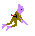 |  |  |
|  |  |  |
<!---
Статусы

-->

## Враг 20
Стрелок из базуки, версия 1
|Кадр 1|Кадр 2|Кадр 3|
|---|---|---|
|  |  |  |
|  |  |  |
### Статусы

-  ***N*** - направление врага (**_0x00_** - вправо, **_0x01_** - влево)
-  ***M*** - флаг прыжка после получения урона (**_0x00_** - не прыгает, **_0x01_** - прыгает)
-  ***L*** - _не используется_
-  ***K*** - _не используется_
-  ***W*** - _не используется_
-  ***Z*** - флаг умирания врага (**_0x00_** - неактивно, **_0x01_** - активно)
-  ***Y*** - флаг получения урона врагом (**_0x00_** - не получает урон, **_0x01_** - получает)
-  ***X*** - общий флаг активности статусов (**_0x00_** - статусы не используются, **_0x01_** - используются)

## Враг 27
Гаргулья
|Кадр 1|Кадр 2|Кадр 3|
|---|---|---|
|  |  |  |
|  |  |  |
<!---
Статусы

-->

## Враг 36
Египтянин с мечом
|Кадр 1|Кадр 2|Кадр 3|Кадр 4|Кадр 5|Кадр 6|Кадр 7|Кадр 8|Кадр 9|
|---|---|---|---|---|---|---|---|---|
|  |  |  |  |  |  |  |  |  |
|  |  |  |  |  |  |  |  |  |
<!---
Статусы

-->

## Враг 37
Египтянин с бумерангом
|Кадр 1|Кадр 2|Кадр 3|Кадр 4|Кадр 5|Кадр 6|Кадр 7|Кадр 8|Кадр 9|
|---|---|---|---|---|---|---|---|---|
|  |  |  |  |  |  |  |  |  |
|  |  |  |  |  |  |  |  |  |

|Кадр 1|Кадр 2|Кадр 3|Кадр 4|Кадр 5|Кадр 6|Кадр 7|Кадр 8|
|---|---|---|---|---|---|---|---|
|  |  |  |  |  |  |  |  |
### Статусы

-  ***N*** - направление врага (**_0x00_** - вправо, **_0x01_** - влево)
-  ***M*** - флаг прыжка, например через препятствие (**_0x00_** - не прыгает, **_0x01_** - прыгает)
-  ***L*** - используется совместно с ***K***
-  ***K*** - используется совместно с ***L***, флаг выстрела (**_0x00_** - неактивно, **_0x01_** - активно)
-  ***W*** - флаг приседания перед прыжком (**_0x00_** - неактивно, **_0x01_** - активно)
-  ***Z*** - флаг умирания врага (**_0x00_** - неактивно, **_0x01_** - активно)
-  ***Y*** - флаг получения урона врагом (**_0x00_** - не получает урон, **_0x01_** - получает)
-  ***X*** - общий флаг активности статусов (**_0x00_** - статусы не используются, **_0x01_** - используются)

## Враг 38
Ниндзя сверху
|Кадр 1|Кадр 2|Кадр 3|Кадр 4|Кадр 5|
|---|---|---|---|---|
|  |  |  |  |  |
|  |  |  |  |  |
### Статусы

-  ***N*** - направление врага (**_0x00_** - вправо, **_0x01_** - влево)
-  ***M*** - флаг прыжка, например через препятствие (**_0x00_** - не прыгает, **_0x01_** - прыгает) ***(???)***
-  ***L*** - флаг наклона (**_0x00_** - не наклоняется, **_0x01_** - наклоняется)
-  ***K*** - флаг выстрела (**_0x00_** - неактивно, **_0x01_** - активно)
-  ***W*** - _не используется_
-  ***Z*** - флаг умирания врага (**_0x00_** - неактивно, **_0x01_** - активно)
-  ***Y*** - флаг получения урона врагом (**_0x00_** - не получает урон, **_0x01_** - получает)
-  ***X*** - общий флаг активности статусов (**_0x00_** - статусы не используются, **_0x01_** - используются)
