|Идентификатор|Имя|Тип|Подробнее|Уровень|
|---|---|---|---|---|
|0x00| - | - | - | - |
|0x01|Cat with the gun| A | [Большой кот](#враг-01) | 3 |
|0x02|Gray land hat| B | [Серая летающая шляпа](#враг-02) | 3 |
|0x03|Black land hat| B | [Черная летающая шляпа](#враг-03) | 3 |
|0x04|Land Diver| A | [Земной водолаз](#враг-04) | 3 |
|0x05|Land Diver| A | [Земной водолаз](#враг-05) | 2 |
|0x06|Land Diver| A | [Земной водолаз](#враг-06) | 1 |
|0x07|Zenigata| A | [Зенигата](#враг-07) |Все|
|0x08|Shooter with bazooka| A | [Стрелок из базуки](#враг-03) | 3 |
|0x09|The fat sailor| A | [Полный моряк](#враг-09) | 3 |
|0x0A|The barrel| B | [Красная бочка](#враг-0a) | 3 |
|0x0B|Jumping sailor| B | [Прыгающий моряк](#враг-0b) | 3 |
|0x0C|The lift| A | [Лифт](#враг-0c) | 3 |
|0x0D|Sensor| B | [Сенсор](#враг-0d) | 3 |
|0x0E|Bat| B | [Летучая мышь](#враг-0e) | 1 |
|0x0F|Gray cat| B | [Серый кот](#враг-0f) | 1 |
|0x10|Nun| A | [Монашка](#враг-10) | 2 |
|0x11|Girl in red, in the castle| A | [Девушка в красном](#враг-11) | 1 |
|0x12|Butterfly| B | [Бабочка](#враг-12) | 2 |
|0x13|Armored butterfly| B | [Бронированная бабочка](#враг-13) | 2 |
|0x14|Shooter with bazooka| A | [Стрелок из базуки](#враг-14) | 2 |
|0x15|Sensor| B | [Сенсор](#враг-15) | 2 |
|0x16|Black cat| B | [Чёрный кот](#враг-16) | 1 |
|0x17|Karate-boy| A | [Каратист](#враг-17) | 2 |
|0x18|Street karate-boy| A | [Уличный каратист](#враг-18) | 2 |
|0x19|Karate-girl| A | [Каратистка](#враг-19) | 2 |
|0x1A|Boy in green| A | [Парень в зелёном](#враг-1a) | 2 |
|0x1B|Girl with sword| A | [Девушка в красном, с мечом](#враг-1b) | 1 |
|0x1C|Knight in armor with a shield| A | [Рыцарь в доспехах](#враг-1c) | 1 |
|0x1D|The barrel| B | [Бочка](#враг-1d) | 2 |
|0x1E|Sensor| B | [Сенсор](#враг-1e) | 1 |
|0x1F|Fly man| A | [Летающий человек](#враг-1f) | 1 |
|0x20|Shooter with bazooka| A | [Стрелок из базуки](#враг-20) | 1 |
|0x21|Cobblestone| B | [Булыжник](#враг-21) |4, ездовой|
|0x22|The bird| B |[Птица](#враг-22)|ездовой|
|0x23|The bird with a bomb| B | [Птица с бомбой](#враг-23) |ездовой|
|0x24|Skeleton| A | [Скелет](#враг-24) | 4 |
|0x25|Diver| B | [Водолаз](#враг-25) |Все|
|0x26|Mummy| A | [Мумия](#враг-26) | 4 |
|0x27|Gargoyle| B | [Гаргулья](#враг-27) | 4 |
|0x28|Boss1| A | [Халк](#враг-28) | 1 |
|0x29| - | - | - | - |
|0x2A|Boss2| A | [Ким](#враг-2a) | 2 |
|0x2B| - | - | - | - |
|0x2C|Boss3| A | [Рейд](#враг-2c) | 3 |
|0x2D| - | - | - | - |
|0x2E|Boss4| A | [Финальный босс](#враг-2e) | 4 |
|0x2F| - | - | - | - |
|0x30|Wall| B | [Стена](#враг-30) | 4 |
|0x31|Wall| B | [Стена](#враг-31) | 4 |
|0x32|Breaking platform| B | [Платформа](#враг-32) | 4 |
|0x33|Blade trap| B | [Ловушка с лезвием](#враг-33) | 4 |
|0x34|Potted snake| B | [Змея в горшке](#враг-34) | 4 |
|0x35|Egyptian with bow| A | [Египтянин с луком](#враг-35) | 4 |
|0x36|Egyptian with a sword| A | [Египтянин с мечом](#враг-36) | 4 |
|0x37|Egyptian with a boomerung| A | [Египтянин с бумерангом](#враг-37) | 4 |
|0x38|Ninja upside down| A | [Ниндзя сверху](#враг-38) | 4 |
|0x39|Sensor| B | [Сенсор](#враг-39) | 4 |
|0x81|Cat with the knife| A | [Большой кот](#враг-01) | 3 |

## Враг 01
Большой кот
|Кадр 1|Кадр 2|Кадр 3|Кадр 4|Кадр 5|Кадр 6|
|---|---|---|---|---|---|
|  |  |  |  |  |  |
|  |  |  |  |  |  |

|Кадр 1|Кадр 2|
|---|---|
|  |  |
|  |  |

|Кадр 1|Кадр 2|
|---|---|
|  |  |
|  |  |
### Статусы 

-  ***N*** - направление врага (**_0x00_** - вправо, **_0x01_** - влево)
-  ***M*** - флаг прыжка, например через препятствие (**_0x00_** - не прыгает, **_0x01_** - прыгает)
-  ***L*** - (_если используется нож_) флаг ближнего контакта (**_0x00_** - неактивно, **_0x01_** - активно)
-  ***L*** - (_если используется пистолет_) используется совместно с ***K***, флаг выстрела (**_0x00_** - неактивно, **_0x01_** - активно)
-  ***K*** - флаг остановки (**_0x00_** - не остановился, **_0x01_** - остановился)
-  ***W*** - флаг приседания перед прыжком (**_0x00_** - неактивно, **_0x01_** - активно)
-  ***Z*** - флаг умирания врага (**_0x00_** - неактивно, **_0x01_** - активно)
-  ***Y*** - флаг получения урона врагом (**_0x00_** - не получает урон, **_0x01_** - получает)
-  ***X*** - общий флаг активности статусов (**_0x00_** - статусы не используются, **_0x01_** - используются)

## Враг 02
Серая летающая шляпа
|Кадр 1|Кадр 2|Кадр 3|
|---|---|---|
|  | 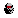 |  |
|  |  |  |
### Статусы

-  ***N*** - направление врага (**_0x00_** - вправо, **_0x01_** - влево)
-  ***M*** - _не используется_
-  ***L*** - _не используется_
-  ***K*** - _не используется_
-  ***W*** - _не используется_
-  ***Z*** - флаг умирания врага (**_0x00_** - неактивно, **_0x01_** - активно)
-  ***Y*** - флаг получения урона врагом (**_0x00_** - не получает урон, **_0x01_** - получает)
-  ***X*** - общий флаг активности статусов (**_0x00_** - статусы не используются, **_0x01_** - используются)

## Враг 03
Чёрная летающая шляпа
|Кадр 1|Кадр 2|Кадр 3|
|---|---|---|
|  |  |  |
|  |  |  |
### Статусы

-  ***N*** - направление врага (**_0x00_** - вправо, **_0x01_** - влево)
-  ***M*** - _не используется_
-  ***L*** - _не используется_
-  ***K*** - _не используется_
-  ***W*** - _не используется_
-  ***Z*** - флаг умирания врага (**_0x00_** - неактивно, **_0x01_** - активно)
-  ***Y*** - флаг получения урона врагом (**_0x00_** - не получает урон, **_0x01_** - получает)
-  ***X*** - общий флаг активности статусов (**_0x00_** - статусы не используются, **_0x01_** - используются)

## Враг 04
Земной водолаз, версия 3
|Кадр 1|Кадр 2|Кадр 3|Кадр 4|Кадр 5|Кадр 6|Кадр 7|
|---|---|---|---|---|---|---|
|  |  |  |  |  |  |  |
|  |  |  |  |  |  |  |
### Статусы
Аналогично [земному водолазу](#враг-06).

## Враг 05
Земной водолаз, версия 2
|Кадр 1|Кадр 2|Кадр 3|Кадр 4|Кадр 5|Кадр 6|Кадр 7|
|---|---|---|---|---|---|---|
|  |  |  |  |  |  |  |
|  |  |  |  |  |  |  |
### Статусы
Аналогично [земному водолазу](#враг-06).

## Враг 06
Земной водолаз, версия 1
<!---

-->
<!---

-->
|Кадр 1|Кадр 2|Кадр 3|Кадр 4|Кадр 5|Кадр 6|Кадр 7|
|---|---|---|---|---|---|---|
|  |  |  |  |  |  |  |
|  |  |  |  |  |  |  |
<!---

-->
### Статусы

-  ***N*** - направление врага (**_0x00_** - вправо, **_0x01_** - влево)
-  ***M*** - флаг прыжка, например через препятствие (**_0x00_** - не прыгает, **_0x01_** - прыгает)
-  ***L*** - флаг появления врага (**_0x00_** - не появляется, **_0x01_** - появляется)
-  ***K*** - флаг остановки (**_0x00_** - не остановился, **_0x01_** - остановился)
-  ***W*** - флаг приседания перед прыжком (**_0x00_** - неактивно, **_0x01_** - активно)
-  ***Z*** - флаг умирания врага (**_0x00_** - неактивно, **_0x01_** - активно)
-  ***Y*** - флаг получения урона врагом (**_0x00_** - не получает урон, **_0x01_** - получает)
-  ***X*** - общий флаг активности статусов (**_0x00_** - статусы не используются, **_0x01_** - используются)

## Враг 07
Зенигата
|Кадр 1|Кадр 2|Кадр 3|Кадр 4|Кадр 5|Кадр 6|Кадр 7|
|---|---|---|---|---|---|---|
|  |  |  |  |  |  |  |
|  |  |  |  |  |  |  |
### Статусы

-  ***N*** - направление врага (**_0x00_** - вправо, **_0x01_** - влево)
-  ***M*** - флаг обычного прыжка и прыжка через препятствие (**_0x00_** - не прыгает, **_0x01_** - прыгает)
-  ***L*** - флаг броска снаряда (**_0x00_** - неактивно, **_0x01_** - активно)
-  ***K*** - флаг остановки (**_0x00_** - не остановился, **_0x01_** - остановился)
-  ***W*** - флаг приседания перед прыжком (**_0x00_** - неактивно, **_0x01_** - активно)
-  ***Z*** - флаг умирания врага (**_0x00_** - неактивно, **_0x01_** - активно)
-  ***Y*** - _не используется_
-  ***X*** - общий флаг активности статусов (**_0x00_** - статусы не используются, **_0x01_** - используются)

## Враг 08
Стрелок из базуки, версия 3
|Кадр 1|Кадр 2|Кадр 3|
|---|---|---|
|  |  |  |
|  |  |  |
### Статусы
Аналогично [стрелку из базуки](#враг-20).

## Враг 09
Полный моряк
|Кадр 1|Кадр 2|Кадр 3|Кадр 4|Кадр 5|
|---|---|---|---|---|
|  |  |  |  |  |
|  |  |  |  |  |
### Статусы

-  ***N*** - направление врага (**_0x00_** - вправо, **_0x01_** - влево)
-  ***M*** - флаг обычного прыжка и прыжка через препятствие (**_0x00_** - не прыгает, **_0x01_** - прыгает)
-  ***L*** - флаг ускоренного режима (**_0x00_** - режим не активирован, **_0x01_** - режим активирован)
-  ***K*** - флаг остановки (**_0x00_** - не остановился, **_0x01_** - остановился)
-  ***W*** - _не используется_
-  ***Z*** - флаг умирания врага (**_0x00_** - неактивно, **_0x01_** - активно)
-  ***Y*** - флаг получения урона врагом (**_0x00_** - не получает урон, **_0x01_** - получает)
-  ***X*** - общий флаг активности статусов (**_0x00_** - статусы не используются, **_0x01_** - используются)

## Враг 0A
Красная бочка
|Кадр 1|Кадр 2|Кадр 3|Кадр 4|
|---|---|---|---|
|  |  |  |  |
### Статусы

-  ***N*** - направление движения (**_0x00_** - вправо, **_0x01_** - влево)
-  ***M*** - флаг падения и отскока (**_0x00_** - не прыгает, **_0x01_** - прыгает)
-  ***L*** - _не используется_
-  ***K*** - _не используется_
-  ***W*** - _не используется_
-  ***Z*** - флаг разрушения (**_0x00_** - неактивно, **_0x01_** - активно)
-  ***Y*** - флаг получения урона врагом (**_0x00_** - не получает урон, **_0x01_** - получает)
-  ***X*** - общий флаг активности статусов (**_0x00_** - статусы не используются, **_0x01_** - используются)

## Враг 0B
Прыгающий моряк
|Кадр 1|Кадр 2|Кадр 3|Кадр 4|Кадр 5|
|---|---|---|---|---|
|  |  |  |  |  |
|  |  |  |  |  |
### Статусы

-  ***N*** - направление врага (**_0x00_** - вправо, **_0x01_** - влево)
-  ***M*** - флаг прыжка (**_0x00_** - не прыгает, **_0x01_** - прыгает)
-  ***L*** - _не используется_
-  ***K*** - флаг ожидания приседания (**_0x00_** - неактивно, **_0x01_** - активно)
-  ***W*** - флаг приседания перед прыжком (**_0x00_** - неактивно, **_0x01_** - активно)
-  ***Z*** - флаг умирания врага (**_0x00_** - неактивно, **_0x01_** - активно)
-  ***Y*** - флаг получения урона врагом (**_0x00_** - не получает урон, **_0x01_** - получает)
-  ***X*** - общий флаг активности статусов (**_0x00_** - статусы не используются, **_0x01_** - используются)

## Враг 0C
Лифт
|Кадр 1|
|---|
|  |
### Статусы

-  ***N*** - направление по-вертикали (**_0x00_** - вверх, **_0x01_** - вниз)
-  ***M*** - _не используется_
-  ***L*** - _не используется_
-  ***K*** - _не используется_
-  ***W*** - _не используется_
-  ***Z*** - _не используется_
-  ***Y*** - возможность стоять на платформе лифта (**_0x00_** - не возможно, **_0x01_** - возможно)
-  ***X*** - общий флаг активности статусов (**_0x00_** - статусы не используются, **_0x01_** - используются)

## Враг 0D
Сенсор
|Кадр 1|
|---|
|  |
### Статусы

-  ***N*** - _не используется_
-  ***M*** - _не используется_
-  ***L*** - _не используется_
-  ***K*** - _не используется_
-  ***W*** - _не используется_
-  ***Z*** - _не используется_
-  ***Y*** - _не используется_
-  ***X*** - общий флаг активности статусов (**_0x00_** - статусы не используются, **_0x01_** - используются)

Снаряд при активации сенсора
|Кадр 1|Кадр 2|Кадр 3|Кадр 4|Кадр 5|Кадр 6|Кадр 7|Кадр 8|
|---|---|---|---|---|---|---|---|
|  |  |  |  |  |  |  |  |
### Статусы

-  ***N*** - _не используется_
-  ***M*** - флаг падения (**_0x00_** - не падает, **_0x01_** - падает)
-  ***L*** - _не используется_
-  ***K*** - _не используется_
-  ***W*** - _не используется_
-  ***Z*** - флаг разрушения снаряда (**_0x00_** - неактивно, **_0x01_** - активно)
-  ***Y*** - флаг получения урона снарядом (**_0x00_** - не получает урон, **_0x01_** - получает)
-  ***X*** - общий флаг активности статусов (**_0x00_** - статусы не используются, **_0x01_** - используются)

## Враг 0E
Летучая мышь
|Кадр 1|Кадр 2|Кадр 3|
|---|---|---|
|  |  |  |
|  |  |  |
### Статусы

-  ***N*** - направление врага (**_0x00_** - вправо, **_0x01_** - влево)
-  ***M*** - _не используется_
-  ***L*** - _не используется_
-  ***K*** - _не используется_
-  ***W*** - _не используется_
-  ***Z*** - флаг умирания врага (**_0x00_** - неактивно, **_0x01_** - активно)
-  ***Y*** - флаг получения урона врагом (**_0x00_** - не получает урон, **_0x01_** - получает)
-  ***X*** - общий флаг активности статусов (**_0x00_** - статусы не используются, **_0x01_** - используются)

## Враг 0F
Серый кот
|Кадр 1|Кадр 2|Кадр 3|Кадр 4|Кадр 5|
|---|---|---|---|---|
|  |  |  |  |  |
|  |  |  |  |  |
### Статусы

-  ***N*** - направление врага (**_0x00_** - вправо, **_0x01_** - влево)
-  ***M*** - флаг прыжка, например через препятствие (**_0x00_** - не прыгает, **_0x01_** - прыгает)
-  ***L*** - _не используется_
-  ***K*** - флаг остановки (**_0x00_** - не остановился, **_0x01_** - остановился)
-  ***W*** - _не используется_
-  ***Z*** - флаг умирания врага (**_0x00_** - неактивно, **_0x01_** - активно)
-  ***Y*** - флаг получения урона врагом (**_0x00_** - не получает урон, **_0x01_** - получает)
-  ***X*** - общий флаг активности статусов (**_0x00_** - статусы не используются, **_0x01_** - используются)

## Враг 10
Монашка
|Кадр 1|Кадр 2|Кадр 3|Кадр 4|Кадр 5|
|---|---|---|---|---|
|  |  |  |  |  |
|  |  |  |  |  |
### Статусы

-  ***N*** - направление врага (**_0x00_** - вправо, **_0x01_** - влево)
-  ***M*** - флаг прыжка (**_0x00_** - не прыгает, **_0x01_** - прыгает)
-  ***L*** - _не используется_
-  ***K*** - флаг ожидания приседания (**_0x00_** - неактивно, **_0x01_** - активно)
-  ***W*** - флаг приседания перед прыжком (**_0x00_** - неактивно, **_0x01_** - активно)
-  ***Z*** - флаг умирания врага (**_0x00_** - неактивно, **_0x01_** - активно)
-  ***Y*** - флаг получения урона врагом (**_0x00_** - не получает урон, **_0x01_** - получает)
-  ***X*** - общий флаг активности статусов (**_0x00_** - статусы не используются, **_0x01_** - используются)

## Враг 11
Девушка в красном
|Кадр 1|Кадр 2|Кадр 3|Кадр 4|Кадр 5|Кадр 6|Кадр 7|Кадр 8|
|---|---|---|---|---|---|---|---|
|  |  |  |  |  |  |  |  |
|  |  |  |  |  |  |  |  |
### Статусы

-  ***N*** - направление врага (**_0x00_** - вправо, **_0x01_** - влево)
-  ***M*** - флаг прыжка, например через препятствие (**_0x00_** - не прыгает, **_0x01_** - прыгает)
-  ***L*** - _не используется_
-  ***K*** - флаг ближнего контакта (**_0x00_** - неактивно, **_0x01_** - активно)
-  ***W*** - флаг приседания перед прыжком (**_0x00_** - неактивно, **_0x01_** - активно)
-  ***Z*** - флаг умирания врага (**_0x00_** - неактивно, **_0x01_** - активно)
-  ***Y*** - флаг получения урона врагом (**_0x00_** - не получает урон, **_0x01_** - получает)
-  ***X*** - общий флаг активности статусов (**_0x00_** - статусы не используются, **_0x01_** - используются)

## Враг 12
Бабочка
|Кадр 1|Кадр 2|Кадр 3|
|---|---|---|
|  |  |  |
|  |  |  |
### Статусы

-  ***N*** - направление врага (**_0x00_** - вправо, **_0x01_** - влево)
-  ***M*** - _не используется_
-  ***L*** - _не используется_
-  ***K*** - _не используется_
-  ***W*** - _не используется_
-  ***Z*** - флаг умирания врага (**_0x00_** - неактивно, **_0x01_** - активно)
-  ***Y*** - флаг получения урона врагом (**_0x00_** - не получает урон, **_0x01_** - получает)
-  ***X*** - общий флаг активности статусов (**_0x00_** - статусы не используются, **_0x01_** - используются)

## Враг 13
Бронированная бабочка
|Кадр 1|Кадр 2|Кадр 3|
|---|---|---|
|  |  |  |
|  |  |  |
### Статусы

-  ***N*** - направление врага (**_0x00_** - вправо, **_0x01_** - влево)
-  ***M*** - _не используется_
-  ***L*** - _не используется_
-  ***K*** - _не используется_
-  ***W*** - _не используется_
-  ***Z*** - флаг умирания врага (**_0x00_** - неактивно, **_0x01_** - активно)
-  ***Y*** - флаг получения урона врагом (**_0x00_** - не получает урон, **_0x01_** - получает)
-  ***X*** - общий флаг активности статусов (**_0x00_** - статусы не используются, **_0x01_** - используются)

## Враг 14
Стрелок из базуки, версия 2
|Кадр 1|Кадр 2|Кадр 3|
|---|---|---|
|  |  |  |
|  |  | 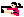 |
### Статусы
Аналогично [стрелку из базуки](#враг-20).

## Враг 15
Сенсор
|Кадр 1|
|---|
|  |
### Статусы
Аналогично [сенсору](#враг-0d).

Снаряд при активации сенсора
|Кадр 1|Кадр 2|Кадр 3|Кадр 4|Кадр 5|Кадр 6|Кадр 7|Кадр 8|
|---|---|---|---|---|---|---|---|
|  |  |  |  |  |  |  |  |
### Статусы
Аналогично [снаряду при активации сенсора](#враг-0d).

## Враг 16
Чёрный кот
|Кадр 1|Кадр 2|Кадр 3|Кадр 4|Кадр 5|
|---|---|---|---|---|
|  |  |  |  |  |
|  |  |  |  |  |
### Статусы

-  ***N*** - направление врага (**_0x00_** - вправо, **_0x01_** - влево)
-  ***M*** - флаг прыжка, например через препятствие (**_0x00_** - не прыгает, **_0x01_** - прыгает)
-  ***L*** - _не используется_
-  ***K*** - флаг остановки (**_0x00_** - не остановился, **_0x01_** - остановился)
-  ***W*** - _не используется_
-  ***Z*** - флаг умирания врага (**_0x00_** - неактивно, **_0x01_** - активно)
-  ***Y*** - флаг получения урона врагом (**_0x00_** - не получает урон, **_0x01_** - получает)
-  ***X*** - общий флаг активности статусов (**_0x00_** - статусы не используются, **_0x01_** - используются)

## Враг 17
Каратист
|Кадр 1|Кадр 2|Кадр 3|Кадр 4|Кадр 5|Кадр 6|Кадр 7|Кадр 8|
|---|---|---|---|---|---|---|---|
|  |  |  |  |  | 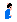 |  |  |
|  |  |  |  |  |  |  |  |

|Кадр 1|Кадр 2|Кадр 3|Кадр 4|Кадр 5|Кадр 6|
|---|---|---|---|---|---|
|  |  |  |  |  |  |
|  |  |  |  |  |  |
### Статусы

-  ***N*** - направление врага (**_0x00_** - вправо, **_0x01_** - влево)
-  ***M*** - флаг прыжка, например через препятствие (**_0x00_** - не прыгает, **_0x01_** - прыгает)
-  ***L*** - используется совместно с ***K***, флаг выстрела (**_0x00_** - неактивно, **_0x01_** - активно)
-  ***K*** - флаг ближнего контакта (**_0x00_** - неактивно, **_0x01_** - активно)
-  ***W*** - флаг приседания перед прыжком (**_0x00_** - неактивно, **_0x01_** - активно)
-  ***Z*** - флаг умирания врага (**_0x00_** - неактивно, **_0x01_** - активно)
-  ***Y*** - флаг получения урона врагом (**_0x00_** - не получает урон, **_0x01_** - получает)
-  ***X*** - общий флаг активности статусов (**_0x00_** - статусы не используются, **_0x01_** - используются)

## Враг 18
Уличный каратист
|Кадр 1|Кадр 2|Кадр 3|Кадр 4|Кадр 5|Кадр 6|Кадр 7|Кадр 8|
|---|---|---|---|---|---|---|---|
|  |  |  |  |  |  |  |  |
|  |  |  |  |  |  |  |  |

|Кадр 1|Кадр 2|Кадр 3|Кадр 4|Кадр 5|Кадр 6|
|---|---|---|---|---|---|
|  |  |  |  |  |  |
|  |  |  |  |  |  |

|Кадр 1|Кадр 2|Кадр 3|Кадр 4|Кадр 5|
|---|---|---|---|---|
|  |  |  |  |  |
|  |  |  |  |  |
### Статусы

-  ***N*** - направление врага (**_0x00_** - вправо, **_0x01_** - влево)
-  ***M*** - флаг прыжка, например через препятствие (**_0x00_** - не прыгает, **_0x01_** - прыгает)
-  ***L*** - флаг вращения во время прыжка (**_0x00_** - сальто, **_0x01_** - обычный прыжок)
-  ***K*** - флаг ближнего контакта (**_0x00_** - неактивно, **_0x01_** - активно)
-  ***W*** - флаг приседания перед прыжком (**_0x00_** - неактивно, **_0x01_** - активно)
-  ***Z*** - флаг умирания врага (**_0x00_** - неактивно, **_0x01_** - активно)
-  ***Y*** - флаг получения урона врагом (**_0x00_** - не получает урон, **_0x01_** - получает)
-  ***X*** - общий флаг активности статусов (**_0x00_** - статусы не используются, **_0x01_** - используются)

## Враг 19
Каратистка
|Кадр 1|Кадр 2|Кадр 3|Кадр 4|Кадр 5|Кадр 6|Кадр 7|Кадр 8|Кадр 9|
|---|---|---|---|---|---|---|---|---|
| 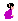 |  |  |  |  |  |  |  |  |
|  |  |  |  |  |  |  |  |  |

|Кадр 1|Кадр 2|Кадр 3|Кадр 4|Кадр 5|Кадр 6|
|---|---|---|---|---|---|
|  |  |  |  |  |  |
|  |  |  |  |  |  |
### Статусы

-  ***N*** - направление врага (**_0x00_** - вправо, **_0x01_** - влево)
-  ***M*** - флаг прыжка, например через препятствие (**_0x00_** - не прыгает, **_0x01_** - прыгает)
-  ***L*** - используется совместно с ***K***, флаг выстрела (**_0x00_** - неактивно, **_0x01_** - активно)
-  ***K*** - флаг уклонения от выстрелов (**_0x00_** - неактивно, **_0x01_** - активно)
-  ***W*** - флаг приседания перед прыжком (**_0x00_** - неактивно, **_0x01_** - активно)
-  ***Z*** - флаг умирания врага (**_0x00_** - неактивно, **_0x01_** - активно)
-  ***Y*** - флаг получения урона врагом (**_0x00_** - не получает урон, **_0x01_** - получает)
-  ***X*** - общий флаг активности статусов (**_0x00_** - статусы не используются, **_0x01_** - используются)

## Враг 1A
Парень в зелёном
|Кадр 1|Кадр 2|Кадр 3|Кадр 4|Кадр 5|Кадр 6|Кадр 7|Кадр 8|Кадр 9|Кадр 10|
|---|---|---|---|---|---|---|---|---|---|
|  |  |  |  |  |  |  |  |  |  |
|  |  |  |  |  |  |  |  |  |  |

|Кадр 1|Кадр 2|Кадр 3|Кадр 4|Кадр 5|Кадр 6|
|---|---|---|---|---|---|
|  |  |  |  |  |  |
|  |  |  |  |  |  |
### Статусы

-  ***N*** - направление врага (**_0x00_** - вправо, **_0x01_** - влево)
-  ***M*** - флаг прыжка, например через препятствие (**_0x00_** - не прыгает, **_0x01_** - прыгает)
-  ***L*** - флаг использования дополнительного оружия, нунчаки (**_0x00_** - не используется, **_0x01_** - используется)
-  ***K*** - флаг ближнего контакта (**_0x00_** - неактивно, **_0x01_** - активно)
-  ***W*** - флаг приседания перед прыжком (**_0x00_** - неактивно, **_0x01_** - активно)
-  ***Z*** - флаг умирания врага (**_0x00_** - неактивно, **_0x01_** - активно)
-  ***Y*** - флаг получения урона врагом (**_0x00_** - не получает урон, **_0x01_** - получает)
-  ***X*** - общий флаг активности статусов (**_0x00_** - статусы не используются, **_0x01_** - используются)

## Враг 1B
Девушка в красном, с мечом
|Кадр 1|Кадр 2|Кадр 3|Кадр 4|Кадр 5|Кадр 6|Кадр 7|Кадр 8|Кадр 9|
|---|---|---|---|---|---|---|---|---|
|  |  |  |  |  |  |  |  |  |
|  |  |  |  |  |  |  |  |  |
### Статусы

-  ***N*** - направление врага (**_0x00_** - вправо, **_0x01_** - влево)
-  ***M*** - флаг прыжка, например через препятствие (**_0x00_** - не прыгает, **_0x01_** - прыгает)
-  ***L*** - _не используется_
-  ***K*** - флаг ближнего контакта (взмахи мечом) (**_0x00_** - неактивно, **_0x01_** - активно)
-  ***W*** - флаг приседания перед прыжком (**_0x00_** - неактивно, **_0x01_** - активно)
-  ***Z*** - флаг умирания врага (**_0x00_** - неактивно, **_0x01_** - активно)
-  ***Y*** - флаг получения урона врагом (**_0x00_** - не получает урон, **_0x01_** - получает)
-  ***X*** - общий флаг активности статусов (**_0x00_** - статусы не используются, **_0x01_** - используются)

## Враг 1С
Рыцарь в доспехах
|Кадр 1|Кадр 2|Кадр 3|Кадр 4|Кадр 5|Кадр 6|Кадр 7|Кадр 8|Кадр 9|
|---|---|---|---|---|---|---|---|---|
|  |  |  |  |  |  |  |  |  |
|  |  |  |  |  |  |  |  |  |
### Статусы

-  ***N*** - направление врага (**_0x00_** - вправо, **_0x01_** - влево)
-  ***M*** - флаг прыжка, например через препятствие (**_0x00_** - не прыгает, **_0x01_** - прыгает)
-  ***L*** - флаг ближнего контакта, атака мечом (**_0x00_** - неактивно, **_0x01_** - активно)
-  ***K*** - флаг скрытия "в стене" (**_0x00_** - неактивно, **_0x01_** - активно)
-  ***W*** - флаг приседания перед прыжком (**_0x00_** - неактивно, **_0x01_** - активно)
-  ***Z*** - флаг умирания врага (**_0x00_** - неактивно, **_0x01_** - активно)
-  ***Y*** - флаг получения урона врагом (**_0x00_** - не получает урон, **_0x01_** - получает)
-  ***X*** - общий флаг активности статусов (**_0x00_** - статусы не используются, **_0x01_** - используются)

## Враг 1D
Бочка
|Кадр 1|Кадр 2|Кадр 3|Кадр 4|
|---|---|---|---|
|  |  |  |  |
### Статусы
Аналогично [красной бочке](#враг-0a).

## Враг 1E
Сенсор
|Кадр 1|
|---|
|  |
### Статусы
Аналогично [сенсору](#враг-0d).

Снаряд при активации сенсора
|Кадр 1|Кадр 2|Кадр 3|Кадр 4|Кадр 5|Кадр 6|Кадр 7|Кадр 8|
|---|---|---|---|---|---|---|---|
|  |  |  |  |  |  |  |  |
### Статусы
Аналогично [снаряду при активации сенсора](#враг-0d).

## Враг 1F
Летающий человек
|Кадр 1|Кадр 2|Кадр 3|
|---|---|---|
|  |  |  |
|  |  |  |
### Статусы

-  ***N*** - направление врага (**_0x00_** - вправо, **_0x01_** - влево)
-  ***M*** - флаг прыжка (траектория полета после получения урона) (**_0x00_** - не прыгает, **_0x01_** - прыгает)
-  ***L*** - _не используется_
-  ***K*** - _не используется_
-  ***W*** - _не используется_
-  ***Z*** - флаг умирания врага (**_0x00_** - неактивно, **_0x01_** - активно)
-  ***Y*** - флаг получения урона врагом (**_0x00_** - не получает урон, **_0x01_** - получает)
-  ***X*** - общий флаг активности статусов (**_0x00_** - статусы не используются, **_0x01_** - используются)

## Враг 20
Стрелок из базуки, версия 1
|Кадр 1|Кадр 2|Кадр 3|
|---|---|---|
|  |  |  |
|  |  |  |
### Статусы

-  ***N*** - направление врага (**_0x00_** - вправо, **_0x01_** - влево)
-  ***M*** - флаг прыжка после получения урона (**_0x00_** - не прыгает, **_0x01_** - прыгает)
-  ***L*** - _не используется_
-  ***K*** - _не используется_
-  ***W*** - _не используется_
-  ***Z*** - флаг умирания врага (**_0x00_** - неактивно, **_0x01_** - активно)
-  ***Y*** - флаг получения урона врагом (**_0x00_** - не получает урон, **_0x01_** - получает)
-  ***X*** - общий флаг активности статусов (**_0x00_** - статусы не используются, **_0x01_** - используются)

## Враг 21
Булыжник
|Кадр 1|Кадр 2|Кадр 3|Кадр 4|
|---|---|---|---|
|  |  |  |  |
### Статусы
Аналогично [красной бочке](#враг-0a).

## Враг 22
Птица
|Кадр 1|Кадр 2|Кадр 3|
|---|---|---|
|  |  |  |
### Статусы

-  ***N*** - _не используется_
-  ***M*** - _не используется_
-  ***L*** - флаг перещения задом (**_0x00_** - неактивно, **_0x01_** - активно)
-  ***K*** - флаг вертикального перещения (**_0x00_** - неактивно, **_0x01_** - активно)
-  ***W*** - _не используется_
-  ***Z*** - флаг умирания врага (**_0x00_** - неактивно, **_0x01_** - активно)
-  ***Y*** - флаг получения урона врагом (**_0x00_** - не получает урон, **_0x01_** - получает)
-  ***X*** - общий флаг активности статусов (**_0x00_** - статусы не используются, **_0x01_** - используются)

## Враг 23
Птица с бомбой
|Кадр 1|Кадр 2|Кадр 3|
|---|---|---|
|  |  |  |
|  |  |  |
### Статусы

-  ***N*** - направление врага (**_0x00_** - вправо, **_0x01_** - влево)
-  ***M*** - флаг ускоренного полёта (**_0x00_** - неактивно, **_0x01_** - активно)
-  ***L*** - _не используется_
-  ***K*** - _не используется_
-  ***W*** - _не используется_
-  ***Z*** - флаг умирания врага (**_0x00_** - неактивно, **_0x01_** - активно)
-  ***Y*** - флаг получения урона врагом (**_0x00_** - не получает урон, **_0x01_** - получает)
-  ***X*** - общий флаг активности статусов (**_0x00_** - статусы не используются, **_0x01_** - используются)

Бомба
|Кадр 1|
|---|
|  |
|  |
### Статусы

-  ***N*** - _не используется_
-  ***M*** - флаг падения бомбы (**_0x00_** - не падает, **_0x01_** - падает)
-  ***L*** - _не используется_
-  ***K*** - _не используется_
-  ***W*** - _не используется_
-  ***Z*** - флаг умирания врага (**_0x00_** - неактивно, **_0x01_** - активно)
-  ***Y*** - флаг получения урона врагом (**_0x00_** - не получает урон, **_0x01_** - получает)
-  ***X*** - общий флаг активности статусов (**_0x00_** - статусы не используются, **_0x01_** - используются)

## Враг 24
Скелет
|Кадр 1|Кадр 2|Кадр 3|Кадр 4|Кадр 5|Кадр 6|
|---|---|---|---|---|---|
|  |  |  |  |  |  |
|  |  |  |  |  |  |

|Кадр 1|Кадр 2|
|---|---|
|  |  |
### Статусы

-  ***N*** - направление врага (**_0x00_** - вправо, **_0x01_** - влево)
-  ***M*** - флаг прыжка, например через препятствие (**_0x00_** - не прыгает, **_0x01_** - прыгает)
-  ***L*** - _не используется_
-  ***K*** - флаг остановки (**_0x00_** - не остановился, **_0x01_** - остановился)
-  ***W*** - флаг приседания перед прыжком (**_0x00_** - неактивно, **_0x01_** - активно)
-  ***Z*** - флаг умирания врага (**_0x00_** - неактивно, **_0x01_** - активно)
-  ***Y*** - флаг получения урона врагом (**_0x00_** - не получает урон, **_0x01_** - получает)
-  ***X*** - общий флаг активности статусов (**_0x00_** - статусы не используются, **_0x01_** - используются)

## Враг 25
Водолаз
|Кадр 1|Кадр 2|Кадр 3|Кадр 4|Кадр 5|Кадр 6|Кадр 7|
|---|---|---|---|---|---|---|
|  |  |  |  |  |  |  |
|  |  |  |  |  |  |  |
### Статусы

-  ***N*** - направление врага (**_0x00_** - вправо, **_0x01_** - влево)
-  ***M*** - флаг варианта вертикального перещения (**_0x00_** - вниз, **_0x01_** - вверх)
-  ***L*** - флаг вертикального перещения (**_0x00_** - неактивно, **_0x01_** - активно)
-  ***K*** - _не используется_
-  ***W*** - _не используется_
-  ***Z*** - флаг умирания врага (**_0x00_** - неактивно, **_0x01_** - активно)
-  ***Y*** - флаг получения урона врагом (**_0x00_** - не получает урон, **_0x01_** - получает)
-  ***X*** - общий флаг активности статусов (**_0x00_** - статусы не используются, **_0x01_** - используются)

## Враг 26
Мумия
|Кадр 1|Кадр 2|Кадр 3|Кадр 4|Кадр 5|
|---|---|---|---|---|
|  |  |  |  |  |
|  |  |  |  |  |
### Статусы

-  ***N*** - направление врага (**_0x00_** - вправо, **_0x01_** - влево)
-  ***M*** - флаг прыжка, например через препятствие (**_0x00_** - не прыгает, **_0x01_** - прыгает)
-  ***L*** - флаг красной подсветки (**_0x00_** - неактивно, **_0x01_** - активно)
-  ***K*** - флаг остановки (**_0x00_** - не остановился, **_0x01_** - остановился)
-  ***W*** - флаг приседания перед прыжком (**_0x00_** - неактивно, **_0x01_** - активно)
-  ***Z*** - флаг умирания врага (**_0x00_** - неактивно, **_0x01_** - активно)
-  ***Y*** - флаг получения урона врагом (**_0x00_** - не получает урон, **_0x01_** - получает)
-  ***X*** - общий флаг активности статусов (**_0x00_** - статусы не используются, **_0x01_** - используются)

## Враг 27
Гаргулья
|Кадр 1|Кадр 2|Кадр 3|
|---|---|---|
|  |  |  |
| 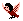 |  |  |
### Статусы

-  ***N*** - направление врага (**_0x00_** - вправо, **_0x01_** - влево)
-  ***M*** - флаг ускоренного режима (**_0x00_** - режим не активирован, **_0x01_** - режим активирован)
-  ***L*** - _не используется_
-  ***K*** - _не используется_
-  ***W*** - _не используется_
-  ***Z*** - флаг умирания врага (**_0x00_** - неактивно, **_0x01_** - активно)
-  ***Y*** - флаг получения урона врагом (**_0x00_** - не получает урон, **_0x01_** - получает)
-  ***X*** - общий флаг активности статусов (**_0x00_** - статусы не используются, **_0x01_** - используются)

## Враг 28
Халк
|Кадр 1|Кадр 2|Кадр 3|Кадр 4|Кадр 5|Кадр 6|
|---|---|---|---|---|---|
|  |  |  |  |  |  |
|  |  |  |  |  |  |

|Кадр 1|Кадр 2|Кадр 3|Кадр 4|Кадр 5|Кадр 6|Кадр 7|
|---|---|---|---|---|---|---|
|  |  |  |  |  |  |  |
|  |  |  |  |  |  |  |

|Кадр 1|Кадр 2|Кадр 3|Кадр 4|
|---|---|---|---|
|  |  |  |  |
### Статусы

-  ***N*** - направление врага (**_0x00_** - вправо, **_0x01_** - влево)
-  ***M*** - флаг блокирования пули после выстрела (**_0x00_** - неактивно, **_0x01_** - активно)
-  ***L*** - флаг броска снаряда (**_0x00_** - неактивно, **_0x01_** - активно)
-  ***K*** - флаг остановки босса (**_0x00_** - не остановился, **_0x01_** - остановился)
-  ***W*** - флаг получения урона (**_0x00_** - не получает урон, **_0x01_** - получает урон)
-  ***Z*** - флаг умирания врага (**_0x00_** - неактивно, **_0x01_** - активно)
-  ***Y*** - флаг отхода назад (**_0x00_** - не отходит, **_0x01_** - отходит)
-  ***X*** - общий флаг активности статусов (**_0x00_** - статусы не используются, **_0x01_** - используются)

## Враг 2A
Ким
|Кадр 1|Кадр 2|Кадр 3|Кадр 4|Кадр 5|Кадр 6|Кадр 7|Кадр 8|Кадр 9|Кадр 10|
|---|---|---|---|---|---|---|---|---|---|
|  |  |  |  |  |  |  |  |  |  |
|  |  | 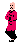 |  |  |  |  | 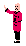 |  |  |
### Статусы

-  ***N*** - направление врага (**_0x00_** - вправо, **_0x01_** - влево)
-  ***M*** - _не используется_
-  ***L*** - флаг броска бабочки (**_0x00_** - неактивно, **_0x01_** - активно)
-  ***K*** - флаг остановки босса (**_0x00_** - не остановился, **_0x01_** - остановился)
-  ***W*** - флаг получения урона (**_0x00_** - не получает урон, **_0x01_** - получает урон)
-  ***Z*** - флаг умирания врага (**_0x00_** - неактивно, **_0x01_** - активно)
-  ***Y*** - _не используется_
-  ***X*** - общий флаг активности статусов (**_0x00_** - статусы не используются, **_0x01_** - используются)

Бабочка Кима
|Кадр 1|Кадр 2|Кадр 3|
|---|---|---|
|  |  |  |
|  | 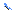 |  |
### Статусы

-  ***N*** - направление врага (**_0x00_** - вправо, **_0x01_** - влево)
-  ***M*** - _не используется_
-  ***L*** - флаг типа полета (**_0x00_** - круговое движение, **_0x01_** - движение по прямой)
-  ***K*** - _не используется_
-  ***W*** - _не используется_
-  ***Z*** - флаг умирания врага (**_0x00_** - неактивно, **_0x01_** - активно)
-  ***Y*** - _не используется_
-  ***X*** - общий флаг активности статусов (**_0x00_** - статусы не используются, **_0x01_** - используются)

## Враг 2C
Рейд
|Кадр 1|Кадр 2|Кадр 3|Кадр 4|Кадр 5|Кадр 6|
|---|---|---|---|---|---|
|  |  |  |  |  |  |
|  |  |  |  |  |  |

|Кадр 1|Кадр 2|Кадр 3|Кадр 4|
|---|---|---|---|
|  |  |  |  |
### Статусы

-  ***N*** - направление врага (**_0x00_** - вправо, **_0x01_** - влево)
-  ***M*** - _не используется_
-  ***L*** - флаг броска снаряда (**_0x00_** - неактивно, **_0x01_** - активно)
-  ***K*** - флаг остановки босса (**_0x00_** - не остановился, **_0x01_** - остановился)
-  ***W*** - флаг получения урона (**_0x00_** - не получает урон, **_0x01_** - получает урон)
-  ***Z*** - флаг умирания врага (**_0x00_** - неактивно, **_0x01_** - активно)
-  ***Y*** - флаг отхода назад (**_0x00_** - не отходит, **_0x01_** - отходит)
-  ***X*** - общий флаг активности статусов (**_0x00_** - статусы не используются, **_0x01_** - используются)

Снаряд Рейда
|Кадр 1|Кадр 2|
|---|---|
|  |  |
### Статусы

-  ***N*** - направление снаряда (**_0x00_** - вправо, **_0x01_** - влево)
-  ***M*** - флаг направление полета снаряда (**_0x00_** - движение по прямой, **_0x01_** - движение по параболе)
-  ***L*** - _не используется_
-  ***K*** - _не используется_
-  ***W*** - _не используется_
-  ***Z*** - флаг разрушения снаряда (**_0x00_** - неактивно, **_0x01_** - активно)
-  ***Y*** - _не используется_
-  ***X*** - общий флаг активности статусов (**_0x00_** - статусы не используются, **_0x01_** - используются)

## Враг 2E
Финальный босс
|Кадр 1|Кадр 2|Кадр 3|Кадр 4|Кадр 5|Кадр 6|Кадр 7|Кадр 8|
|---|---|---|---|---|---|---|---|
|  |  |  |  |  |  |  |  |
| 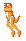 |  |  |  |  |  |  |  |

|Кадр 9|Кадр 10|Кадр 11|Кадр 12|Кадр 13|Кадр 14|Кадр 15|Кадр 16|
|---|---|---|---|---|---|---|---|
|  |  |  |  |  |  |  |  |
|  |  |  |  |  |  |  |  |

|Кадр 17|Кадр 18|Кадр 19|Кадр 20|
|---|---|---|---|
|  |  |  |  |
|  |  |  |  |

|Кадр 1|Кадр 2|
|---|---|
|  |  |
### Статусы

-  ***N*** - направление врага (**_0x00_** - вправо, **_0x01_** - влево)
-  ***M*** - флаг падения после получения финального урона (**_0x00_** - неактивно, **_0x01_** - активно)
-  ***L*** - флаг атаки мечом (**_0x00_** - неактивно, **_0x01_** - активно)
-  ***K*** - флаг ожидания перед началом боя (**_0x00_** - нет ожидания, **_0x01_** - есть ожидание)
-  ***W*** - флаг получения урона (**_0x00_** - не получает урон, **_0x01_** - получает урон)
-  ***Z*** - флаг умирания врага (на земле) (**_0x00_** - неактивно, **_0x01_** - активно)
-  ***Y*** - _не используется_
-  ***X*** - общий флаг активности статусов (**_0x00_** - статусы не используются, **_0x01_** - используются)

## Враг 30
Стена
|Кадр 1|Кадр 2|
|---|---|
|  |  |
### Статусы

-  ***N*** - _не используется_
-  ***M*** - _не используется_
-  ***L*** - _не используется_
-  ***K*** - _не используется_
-  ***W*** - _не используется_
-  ***Z*** - _не используется_
-  ***Y*** - флаг получения урона врагом (**_0x00_** - не получает урон, **_0x01_** - получает)
-  ***X*** - общий флаг активности статусов (**_0x00_** - статусы не используются, **_0x01_** - используются)

## Враг 31
Стена

Аналогично [стене](#враг-30).

## Враг 32
Платформа
|Кадр 1|Кадр 2|Кадр 3|Кадр 4|Кадр 5|
|---|---|---|---|---|
|  |  |  |  |  |
### Статусы

-  ***N*** - вертикальное направление (**_0x00_** - вверх, **_0x01_** - вниз)
-  ***M*** - флаг перемещения (**_0x00_** - не перемещается, **_0x01_** - перемещается)
-  ***L*** - _не используется_
-  ***K*** - _не используется_
-  ***W*** - режим перемещения (**_0x00_** - вниз и вверх, **_0x01_** - только вниз)
-  ***Z*** - флаг разрушения (**_0x00_** - неактивно, **_0x01_** - активно)
-  ***Y*** - возможность персонажа встать на платформу (**_0x00_** - не может встать, **_0x01_** - может встать)
-  ***X*** - общий флаг активности статусов (**_0x00_** - статусы не используются, **_0x01_** - используются)

## Враг 33
Ловушка с лезвием
|Кадр 1|Кадр 2|Кадр 3|Кадр 4|Кадр 5|Кадр 6|
|---|---|---|---|---|---|
|  |  |  |  | 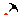 |  |
### Статусы

-  ***N*** - _не используется_
-  ***M*** - _не используется_
-  ***L*** - _не используется_
-  ***K*** - _не используется_
-  ***W*** - _не используется_
-  ***Z*** - _не используется_
-  ***Y*** - _не используется_
-  ***X*** - общий флаг активности статусов (**_0x00_** - статусы не используются, **_0x01_** - используются)

## Враг 34
Змея в горшке
|Кадр 1|Кадр 2|Кадр 3|Кадр 4|Кадр 5|Кадр 6|Кадр 7|
|---|---|---|---|---|---|---|
|  |  |  |  |  |  |  |
|  |  |  |  |  |  | |
### Статусы

-  ***N*** - направление врага (**_0x00_** - вправо, **_0x01_** - влево)
-  ***M*** - флаг прыжка, например через препятствие (**_0x00_** - не прыгает, **_0x01_** - прыгает)
-  ***L*** - _не используется_
-  ***K*** - флаг остановки (**_0x00_** - не остановился, **_0x01_** - остановился)
-  ***W*** - флаг появления врага (вылезание из горшка) (**_0x00_** - не появляется, **_0x01_** - появляется)
-  ***Z*** - флаг умирания врага (**_0x00_** - неактивно, **_0x01_** - активно)
-  ***Y*** - флаг получения урона врагом (**_0x00_** - не получает урон, **_0x01_** - получает)
-  ***X*** - общий флаг активности статусов (**_0x00_** - статусы не используются, **_0x01_** - используются)

## Враг 35
Египтянин с луком
|Кадр 1|Кадр 2|Кадр 3|Кадр 4|Кадр 5|Кадр 6|Кадр 7|Кадр 8|
|---|---|---|---|---|---|---|---|
|  |  | 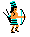 |  |  |  |  |  |
|  |  |  |  |  |  | 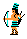 |  |
### Статусы

-  ***N*** - направление врага (**_0x00_** - вправо, **_0x01_** - влево)
-  ***M*** - флаг прыжка, например через препятствие (**_0x00_** - не прыгает, **_0x01_** - прыгает)
-  ***L*** - используется совместно с ***K***
-  ***K*** - используется совместно с ***L***, флаг выстрела (**_0x00_** - неактивно, **_0x01_** - активно)
-  ***W*** - флаг приседания перед прыжком (**_0x00_** - неактивно, **_0x01_** - активно)
-  ***Z*** - флаг умирания врага (**_0x00_** - неактивно, **_0x01_** - активно)
-  ***Y*** - флаг получения урона врагом (**_0x00_** - не получает урон, **_0x01_** - получает)
-  ***X*** - общий флаг активности статусов (**_0x00_** - статусы не используются, **_0x01_** - используются)

## Враг 36
Египтянин с мечом
|Кадр 1|Кадр 2|Кадр 3|Кадр 4|Кадр 5|Кадр 6|Кадр 7|Кадр 8|Кадр 9|
|---|---|---|---|---|---|---|---|---|
|  |  |  |  |  |  |  |  |  |
|  |  |  |  |  |  |  |  |  |
### Статусы

-  ***N*** - направление врага (**_0x00_** - вправо, **_0x01_** - влево)
-  ***M*** - флаг прыжка, например через препятствие (**_0x00_** - не прыгает, **_0x01_** - прыгает)
-  ***L*** - используется совместно с ***K***
-  ***K*** - используется совместно с ***L***, флаг ближнего контакта (**_0x00_** - неактивно, **_0x01_** - активно)
-  ***W*** - флаг приседания перед прыжком (**_0x00_** - неактивно, **_0x01_** - активно)
-  ***Z*** - флаг умирания врага (**_0x00_** - неактивно, **_0x01_** - активно)
-  ***Y*** - флаг получения урона врагом (**_0x00_** - не получает урон, **_0x01_** - получает)
-  ***X*** - общий флаг активности статусов (**_0x00_** - статусы не используются, **_0x01_** - используются)

## Враг 37
Египтянин с бумерангом
|Кадр 1|Кадр 2|Кадр 3|Кадр 4|Кадр 5|Кадр 6|Кадр 7|Кадр 8|Кадр 9|
|---|---|---|---|---|---|---|---|---|
|  |  |  |  |  |  |  |  |  |
|  |  |  |  |  |  |  |  |  |

|Кадр 1|Кадр 2|Кадр 3|Кадр 4|Кадр 5|Кадр 6|Кадр 7|Кадр 8|
|---|---|---|---|---|---|---|---|
|  |  |  |  |  |  |  |  |
### Статусы

-  ***N*** - направление врага (**_0x00_** - вправо, **_0x01_** - влево)
-  ***M*** - флаг прыжка, например через препятствие (**_0x00_** - не прыгает, **_0x01_** - прыгает)
-  ***L*** - используется совместно с ***K***
-  ***K*** - используется совместно с ***L***, флаг выстрела (**_0x00_** - неактивно, **_0x01_** - активно)
-  ***W*** - флаг приседания перед прыжком (**_0x00_** - неактивно, **_0x01_** - активно)
-  ***Z*** - флаг умирания врага (**_0x00_** - неактивно, **_0x01_** - активно)
-  ***Y*** - флаг получения урона врагом (**_0x00_** - не получает урон, **_0x01_** - получает)
-  ***X*** - общий флаг активности статусов (**_0x00_** - статусы не используются, **_0x01_** - используются)

## Враг 38
Ниндзя сверху
|Кадр 1|Кадр 2|Кадр 3|Кадр 4|Кадр 5|
|---|---|---|---|---|
|  |  |  |  |  |
|  |  |  |  |  |
### Статусы

-  ***N*** - направление врага (**_0x00_** - вправо, **_0x01_** - влево)
-  ***M*** - флаг прыжка, например через препятствие (**_0x00_** - не прыгает, **_0x01_** - прыгает) ***(???)***
-  ***L*** - флаг наклона (**_0x00_** - не наклоняется, **_0x01_** - наклоняется)
-  ***K*** - флаг выстрела (**_0x00_** - неактивно, **_0x01_** - активно)
-  ***W*** - _не используется_
-  ***Z*** - флаг умирания врага (**_0x00_** - неактивно, **_0x01_** - активно)
-  ***Y*** - флаг получения урона врагом (**_0x00_** - не получает урон, **_0x01_** - получает)
-  ***X*** - общий флаг активности статусов (**_0x00_** - статусы не используются, **_0x01_** - используются)

## Враг 39
Сенсор
|Кадр 1|
|---|
|  |
### Статусы
Аналогично [сенсору](#враг-0d).

Снаряд при активации сенсора
|Кадр 1|Кадр 2|Кадр 3|Кадр 4|Кадр 5|Кадр 6|Кадр 7|Кадр 8|
|---|---|---|---|---|---|---|---|
|  |  |  |  |  |  |  |  |
### Статусы
Аналогично [снаряду при активации сенсора](#враг-0d).