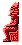

# Общие обозначения

***0x00*** - шестнадцатиричное представление числа

***0%00000000*** - двоичное представление числа

***0xX0*** - шестнадцатиричное представление числа, где X - произвольно значение от 0 до 16 (т.е. от 0x00 до 0x0F), например 0xA0 или 0x50
В выражении 0xXX совсем не значит, что первое значение полубайте совпадает со вторым значением полубайт.
Их повторяемость лишь подчеркивает общую смысловую часть.

***0%XXXX0000*** - двоичное представление числа, где X - произвольно значение от 0 до 1, например 0%12340000 или 0%FEDC0000
В выражении 0%XXXX0000 совсем не значит, что произвольные биты имеют одинаковые значения.
Их повторяемость лишь подчеркивает общую смысловую часть, т.е. первые 4 бита кодируют информацию с 16 всевозможными вариантами.

***{}*** - множество допустимых числе, например {0x00, 0x01}

***|0xXX|*** - абсолютное значение числа, например |0xFF| = 0x01

***==*** - оператор равенства, аналогичный по смыслу операторам в C++, javaScript и т.д.

***!=*** - оператор неравенства, аналогичный по смыслу операторам в C++, javaScript и т.д.

Нуменая битов байта идет справа на лево, начиная с 0-я, т.е. 0-вой бит - это самый правый бит, а 7-ой - самый левый

***[Hx:Lx]*** - пара значений, старшее и младшее значение в контексте использования x. Например, [Hс:Lс] может означать положение персонажа игры относительно игровой области (младшее значение в рамках экрана, старшее значение - номер экрана).

# Аннотации по кодовым инструкциям

***!(WHY?)*** - избыточная инструкция, как например сложение с нулем или деление на единицу.

***!(UNUSED)*** - инструкция, которая никогда не выполнится

***!(BUG?)*** - ошибочная инструкция

# BBBAAAAA формат

Этот сжатый формат нужен для адресации к памяти, с учетом банка и страницы банка.
Представим байт в виде `0%BBBAAAAA`, где B - 7-ой, 6-ой и 5-ый бит, а A - все остальные.
Биты BBB задают номер банка маппера с учетом страницы.

|BBB|Банк и страница|ROM адрес|
|---|---|---|
|0x00|0 банк, 1 страница|0x000010-0x00200F|
|0x01|0 банк, 2 страница|0x002010-0x00400F|
|0x02|1 банк, 1 страница|0x004010-0x00600F|
|0x03|1 банк, 2 страница|0x006010-0x00800F|
|0x04|2 банк, 1 страница|0x008010-0x00A00F|
|0x05|2 банк, 2 страница|0x00A010-0x00C00F|
|0x06|3 банк, 1 страница|0x00C010-0x00E00F|
|0x07|3 банк, 2 страница|0x00E010-0x01000F|

Биты AAAAA - часть адреса, которая суммируется с 0x80.

## Пример

У нас имеется сжатый старший байт адреса - `0x45`, т.е. `0%01000101`.
Судя по таблице, это 1 банк, 1 страница, а настоящий старший байт адреса - `0x85`.

# Структура BackgroundScreenInfo

Cтруктура представляет собой набор из 8 байт, т.е. 4 слов.
Каждое из 4 слово задает адрес в памяти.
Первые 3 слова представляет собой младший байт адреса и старший байт адреса.
Старший байт адреса задается в формате [BBBAAAAA](terminology.md#BBBAAAAA-формат).
У 4-го слова старший байт просто суммируется  с 0x80, а младшая часть не меняется.
Это связано, что все адреса находятся в том же банке и той же странице, т.е. в 00 банке, на 1 странице.

* ***1 слово*** - адрес на индексы элементов экрана комнаты.
Эти индексы задают номера метатайлов в таблице метатайлов заднего фона.
Также эти индексы совпадают с индексами таблицы столкновений.
* ***2 слово*** - адрес на таблицу атрибутов заднего фона экрана комнаты.
* ***3 слово*** - адрес на таблицу метатайлов заднего фона
* ***4 слово*** - адрес на список номеров CHR ROM байтов.

Их, согласно описанию [маппера](https://www.nesdev.org/wiki/INES_Mapper_206), может использоваться одновременно 6 штук.

# Модели неиграбельных персонажей для уникальных комнат

|Идентификатор|Имя|Миниатюра|Внешний вид|
|---|---|---|---|
|0x01|Граф Калиостро 1|  |  |
|0x02|Граф Калиостро 2|  |  |
|0x03|Мужчина 1|  |  |
|0x04|Мужчина 2|  |  |
|0x05|Моряк 1|  |  |
|0x06|Моряк 2|  |  |
|0x07|Гробница 1|  |  |
|0x08|Гробница 2|  |  |
|0x09|Женщина 1|  |  |
|0x0A|Женщина 2|  |  |
|0x0B|Женщина 3|  |  |
|0x0C|Гробница 3|  |  |
|0x0D|Гробница 4|  |  |
|0x0E|Гробница 5|  |  |
|0x0F|Женщина 1|  |  |
|0x10|Женщина 2|  |  |
|0x11|Женщина 3|  |  |
|0x12|Женщина 4|  |  |
|0x13|Женщина 5|  |  |
|0x14|Женщина 6|  |  |
|0x15|Гробница 6|  |  |
|0x16|Гробница 7|  |  |
|0x17|Yi 1|  |  |
|0x18|Yi 2|  |  |
|0x19|Lian 1|  |  |
|0x1A|Lian 2|  |  |
|0x1B|San 1|  |  |
|0x1C|San 2|  |  |
|0x1D|Suu 1|  |  |
|0x1E|Suu 2|  |  |
|0x1F|Гробница 8|  |  |
|0x20|Гробница 9|  |  |
|0x21|Гробница 10|  |  |
|0x22|Женщина 7|  |  |
|0x23|Гробница 11|  |  |
|0x24| ? |  |  |
|0x25|Халк|  |  |
|0x26|Ким|  |  |
|0x27|Рейд|  |  |
|0x28|Люпен|  |  |
|0x29|Дзигэн|  |  |
|0x2A|Гоэмон|  |  |
|0x2B|Фудзико|  |  |
|0x2C|Кларисса|  |  |
|0x2D|Дзэнигата|  |  |